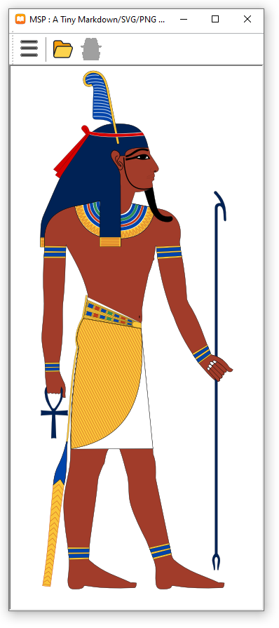

# What is MSP?

MSP is a tiny and open-sourced viewer to view markdown + svg + png files, and this is where its name come from. It has the same effects just like what you see the *.md file from github.com.

It is a native application developed in C/C++, and it includes all the source codes of the library that it uses, so it has dependency with nothing else except the OS itself.

It can be runing on Windows(64-bit), MacOS(64-bit), Linux(64-bit) and iOS(64-bit).

MSP uses CMake to build the program.

Here is the demo of the SVG file showing in MSP viewer

The below is the svg file showing in browser. You can compare these two pictures.

### directory layout:
- src : contains all the source code
- doc : cocntains the documents for MSP project.

### Build Instruction:
Only on Windows Platform

1. Install [Visual Studio 2022 Community version](https://visualstudio.microsoft.com/vs/). It is free!
2. Install [CMake](https://cmake.org/download). I am using 3.26.3 version. Any version newer than this should be good.
3. Download MSP zip file or run: "git clone https://github.com/itgotousa/msp.git" command to extract the last version code.
4. I assume your MSP code is in: D:\github\msp
5. Open "Visual Studio 2022的X64 Native Tools Command Prompt for VS 2022" command line window. You can easily find it in the main menu of Windows 10 after your Visual Studio 2022 software installaltion is done.
6. In the command line window of step 5, mkdir a new dir, such as c:\temp\build, then cd to c:\temp\build.
7. Still in the same command line window, in C:\temp\build directory, run "cmake -G "NMake Makefiles" D:\github\msp\src"
8. In the same command line window, run "nmake"
9. Then you can find the final .exe file in c:\temp\build\arch\windows\msp-win64.exe, just run it and enjoy it.

Please contact itgotousa@gmail.com if you have trouble in building MSP. Please provide details of your error message.

***

Enjoy coding, enjoy your life!

