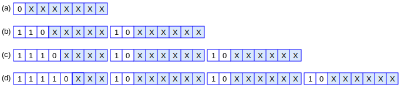
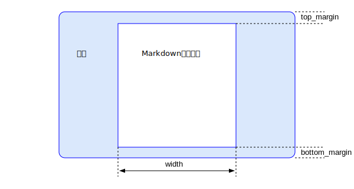

## 设计内幕

MSP使用到的第三方部件有：
- zlib
- libpng
- WTL as the GUI interface of Win64 platform.

由于作者对Windows平台的开发最为熟悉，所以本项目优先实现在Windows平台上的开发。以下是几点设计上的考虑
- 把平台无关的代码和操作系统相关的代码分开，方便移植。
- 使用CMake作为跨平台编译的构建系统。
- 最小化调用操作系统的功能。
- 大量借鉴PostgreSQL的源代码，因为作者是PostgreSQL DBA
- Windows下只支持64位编译。
- 在Windows下的渲染使用Direct2D和DirectWrite技术，支持GPU硬件加速。
- 第一版是单窗口模式，未来计划参考[Windows Terminal](https://github.com/microsoft/terminal)的源代码变成多Tab结构。

编写代码的几点考量
- *.cpp是C++代码, *.c是纯C代码，*.h是C的头文件，*.hpp是C++的头文件。
- 和平台无关的class的命名使用M开头，如MParser。和平台相关的用N开头，表示Native，如NRender
- 类的成员变量均以m_开头，和非类变量区别开来
- 从PostgreSQL拷贝的源码保持文件名、变量名和函数名不变。

### utf8编码

### Markdown的语法树

Markdown文档被解析器解析后，形成一个语法树。渲染引擎在把各元素显示在屏幕上时，采用深入优先的搜索顺序依次遍历该语法树。图中的编号是遍历的顺序。

语法树上的节点有如下类型：
- MDDocument 为根节点。每一个非空的md文件有且只有一个MDDocument节点。非空表示该文件存在至少一个非空白字符。
- MDHeading节点，有一个level变量表示层级，从1到6。
- MDList节点
- MDCode节点
- MDLink节点

### 源代码目录布局
MSP的源代码把平台无关的部分和平台相关部分分开。
- 源代码目录 msp/src，在这里包含了全部的原代码。
- msp/src/pgcore中包含来自PostgreSQL内核的源代码。
- msp/src/arch包含对应的平台相关代码，分为windows/mac/linux/ios/android
- msp/src/svg中包含svg和平台无关的代码。
- msp/src/md中包含markdown文件和平台无关的代码。

### 如何判断文件类型
1. 把文件以二进制的形式读入内存。
2. 如果头8个字节是89 50 4e 47 0d 0a 1a 0a， 则认为该文件是PNG格式。
3. 如果除去空格和tab字符，以<svg开头，则认为是svg文件。
4. 如果扫描最多1204个字节，均为utf8编吗，则认为该文件为markdown的文本文件。
5. 除了md/svg/png类型的文件外，别的任何文件类型均不支持，以保持最大程度的简约。

### 控制显示的参数(Theme)

配置文件msp.json为一jason格式的文本文件，需要手工设置设置各种显示的参数：
- top_margin : Markdown显示区域距离屏幕顶端的距离，单位是像素。
- bottom_margin : Markdown显示区域距离屏幕底端的距离，单位是像素。
- width : Markdown显示区域的宽度，单位是像素。
- background_color : Markdown显示区域的背景颜色，缺省为白色
- screen_color : 非Markdown显示区域的背景颜色。
- text_font : 正文使用的字体
- text_color : 正文的颜色
- h1_font : 一级标题使用的字体
- h2_font : 二级标题使用的字体
- h3_font : 三级标题使用的字体
- h4_font : 四级标题使用的字体
- h5_font : 五级标题使用的字体
- h6_font : 六级标题使用的字体
- link_color : 超链的颜色
- 后面继续设置。

### Text渲染引擎

我打算采用Windows Terminal中最新的Atlas文本渲染引擎来做MSP的文本渲染。 本节内容提供了我对Atlas的研究成果。

### SVG渲染引擎

采用Adobe开源的SVG引擎进行魔改

https://github.com/adobe/svg-native-viewer

cmake -Bbuild/win64 -H. -G "Visual Studio 16 2019" -DGDIPLUS=ON -DD2D=ON

SVGDocument

