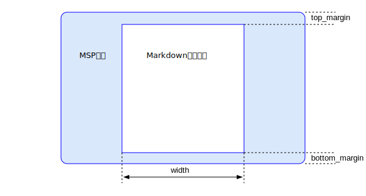

## 设计内幕

由于作者对Windows平台的开发最为熟悉，所以本项目优先实现在Windows平台上的开发。以下是几点设计上的考虑
- 把平台无关的代码和操作系统相关的代码分开，方便移植。
- 使用CMake作为跨平台编译的构建系统。
- 最小化调用操作系统的功能。
- 大量借鉴PostgreSQL的源代码，因为作者是PostgreSQL DBA
- 能不使用第三方库就不使用。zlib/curl这样的成熟库可以引入。
- 在Windows下的渲染使用Direct2D和DirectWrite技术，支持GPU硬件加速。
- 第一版是单窗口模式，未来计划参考[Windows Terminal](https://github.com/microsoft/terminal)的源代码变成多Tab结构。

编写代码的几点考量
- *.cpp是C++代码, *.c是纯C代码，*.h是C的头文件，*.hpp是C++的头文件。
- 和平台无关的class的命名使用M开头，如MParser。和平台相关的用N开头，表示Native，如NRender
- 类的成员变量均以m_开头，和非类变量区别开来
- 从PostgreSQL拷贝的源码保持文件名、变量名和函数名不变。

### utf8编码

### Markdown的语法树

Markdown文档被解析器解析后，形成一个语法树。渲染引擎在把各元素显示在屏幕上时，采用深入优先的搜索顺序依次遍历该语法树。图中的编号是遍历的顺序。

语法树上的节点有如下类型：
- MDDocument 为根节点。每一个非空的md文件有且只有一个MDDocument节点。非空表示该文件存在至少一个非空白字符。
- MDHeading节点，有一个level变量表示层级，从1到6。
- MDList节点
- MDCode节点
- MDLink节点

### 源代码目录布局
MSP的源代码把平台无关的部分和平台相关部分分开。
- 源代码目录 msp/src，在这里包含了全部的原代码。
- msp/src/pgcore中包含来自PostgreSQL内核的源代码。
- msp/src/arch包含对应的平台相关代码，分为windows/mac/linux/ios/android
- msp/src/svg中包含svg和平台无关的代码。
- msp/src/md中包含markdown文件和平台无关的代码。

### 如何判断文件类型
1. 如果文件体积大于512M，则拒绝处理。把文件以二进制的形式一次性读入内存。
2. 如果头8个字节是89 50 4e 47 0d 0a 1a 0a， 则认为该文件是PNG格式。
3. 如果除去空格和tab字符，以<svg开头，则认为是svg文件。
4. 如果扫描最多1024个字节，若均为utf8编码，则认为该文件为markdown的文本文件。
5. 除了md/svg/png类型的文件外，别的任何文件类型均不支持，以保持最大程度的简约。
6. 文本文件只支持utf8编码。如果用户的文件是别的编码格式，需要他先转换为utf8以后再用msp进行阅读。

### 渲染引擎的优化
我们以Windows下的Direct2D为例，讲解设计思想：

当用户通过拖拽或者菜单的方式打开一个svg文件，MSP就会启动一个后台线程，这个线程的任务如下：
- 把svg文件一股脑读入到内存的一个buffer里面。
- 使用flex和bison对其进行解析，产生一个语法树(parse tree)。
- 对语法树进行语义分析，产生渲染树(render tree)。
- 通知前台的UI线程进行渲染。

因为前台的渲染速度直接影响到用户的体验，所以我们要把一切不该渲染引擎做的工作统统都交给后台线程进行完成。根据SVG的规范，SVG只支持三种对象：矢量的图形(graphic)，点阵的图像(image)和文本(text)，渲染树就是一个单向链表。

SVG allows for three types of graphic objects: vector graphic shapes (e.g., paths consisting of straight lines and curves), images and text.

这个单向链表的头四个字节中的最高位的2个比特表示渲染对象的类型：0表示无效，1表示graphic，2表示文本，3表示图像。渲染引擎只要从头开始扫描该单向链表，因此执行相应的画图动作即可。画图动作所需要的所有准备工作都已经在后台线程里计算完毕了，包括嵌套的矩阵变化等。这样简单的渲染引擎有着最高的渲染效率。

上图是整体设计。md/svg文件经过flex/bison制作的解析器，变成了一棵语法树(parse tree)，然后经过语义分析，形成了一个渲染树，渲染树实际上就是一个单向链表。真正渲染的代码依次扫描这个单向链表，按照指令把各种对象显示在屏幕上。 所有的字体形成一个字体数组，渲染树上的每个节点，如果是Text类型，就有一个指针指向字体数组对应的字体资源。MSP内嵌了华为的鸿蒙字体，如果不指定字体，就使用鸿蒙字体进行显示。

### 文件包含文件的问题

在md和svg文件中均可以包含另外的文件。为了避免循环包含，做如下设计
1. 如果包含的路径第一个字符是/，则是绝对路径。否则是相对相对路径。
2. 把每个包含的路径插入到一个哈希表中。如果能在哈希表中查找到一个路径，则证明有循环路径，就放弃该路径的处理。
3. 暂时不考虑包含网络链接的问题，只处理本地文件路径的包含问题。后续版本可以考虑引入libcurl来处理网络链接的问题。

### 控制显示的参数(Theme)

配置文件msp.json为一jason格式的文本文件，需要手工设置设置各种显示的参数：
- top_margin : Markdown显示区域距离屏幕顶端的距离，单位是像素。
- bottom_margin : Markdown显示区域距离屏幕底端的距离，单位是像素。
- width : Markdown显示区域的宽度，单位是像素。
- background_color : Markdown显示区域的背景颜色，缺省为白色
- window_color : 非Markdown显示区域的背景颜色。
- text_font : 正文使用的字体
- text_color : 正文的颜色
- h1_font : 一级标题使用的字体
- h2_font : 二级标题使用的字体
- h3_font : 三级标题使用的字体
- h4_font : 四级标题使用的字体
- h5_font : 五级标题使用的字体
- h6_font : 六级标题使用的字体
- link_color : 超链的颜色

后面继续设置。MSP内置华为免费的[鸿蒙字体](https://developer.harmonyos.com/cn/docs/design/font-0000001157868583)作为缺省字体，这样就不受操作系统环境的影响了。

### Direct2D API

- ID2D1GeometrySink::AddArc
- ID2D1GeometrySink::AddBezier 
- ID2D1GeometrySink::AddLine
- ID2D1GeometrySink::AddQuadraticBezier

### DirectWrite API
- CreateFontFace : IDWriteFactory --> IDWriteFontFile --> IDWriteFontFace
- GetFontFromFontFace : from IDWriteFontFace --> IDWriteFont
- GetFontFamily : IDWriteFont --> IDWriteFontFamily : GetFamilyNames
-  IDWriteFontSet --> IDWriteFontFaceReference (GetFontFaceReference) --> IDWriteFontFace3(CreateFontFace)
- CreateFontCollectionFromFontSet : IDWriteFontSet --> IDWriteFontCollection1

	HRSRC  res = FindResource(hInstance, MAKEINTRESOURCE(IDR_FONT_HARMONYOS_THIN), RT_RCDATA);
	if(res)
	{
		HGLOBAL res_handle = LoadResource(hInstance, res);
		if(res_handle)
		{

			BYTE* data 	 = (BYTE*)LockResource(res_handle);
			DWORD size	 = SizeofResource(hInstance, res);
			d2d.fontResource->AttachFontResource(data, size);

			hr = d2d.pDWriteFactory->CreateInMemoryFontFileLoader(&(d2d.fontLoader));
			if(SUCCEEDED(hr))
			{
				hr = d2d.pDWriteFactory->RegisterFontFileLoader(d2d.fontLoader);
				if(SUCCEEDED(hr))
				{
					IDWriteFontFile* fontFileReference;
					hr = d2d.fontLoader->CreateInMemoryFontFileReference(
									d2d.pDWriteFactory,
									data,
									size,
									d2d.fontResource,
									&fontFileReference);
					if(SUCCEEDED(hr))
					{

						IDWriteFontSetBuilder1* fb;	
						hr = d2d.pDWriteFactory->CreateFontSetBuilder(&fb);
						if(SUCCEEDED(hr))
						{
							hr = fb->AddFontFile(fontFileReference);
							if(SUCCEEDED(hr))
							{
								IDWriteFontSet* pFontSet;
								fb->CreateFontSet(&pFontSet);
								if(SUCCEEDED(hr))
								{
									UINT32 fc = pFontSet->GetFontCount();
									IDWriteFont* pFont;
									BOOL exists;
									hr = pFontSet->GetFontByIndex(i, &pFont, &exists);
#if 0
									IDWriteStringList* localizedFamilyNames = NULL;
									hr = pFontSet->GetPropertyValues(DWRITE_FONT_PROPERTY_ID_FULL_NAME, &localizedFamilyNames);
									if (SUCCEEDED(hr))
									{
										wchar_t fontFamilyName[256] = { 0 };
										hr = localizedFamilyNames->GetString(0, fontFamilyName, 255);
										fc++;
									}
#endif
									SAFERELEASE(pFontSet);
								}
							}
							SAFERELEASE(fb);
						}
						SAFERELEASE(fontFileReference);
					}

				}
			}
		}
	}

#if 0
				UINT32 cnt = fc1->GetFontFamilyCount();
				IDWriteFontFamily* ffm;
				hr = fc1->GetFontFamily(0, &ffm);
				if (FAILED(hr))
				{
					delete d2d.fontResource;
					d2d.fontResource = nullptr;
					SAFERELEASE(fc1);
					SAFERELEASE(pFontSet);
					SAFERELEASE(fb);
					SAFERELEASE(fontFileReference);
					return 0;
				}

				UINT32 index = 0;
				BOOL exists = false;
				IDWriteLocalizedStrings* pFamilyNames = NULL;
				hr = ffm->GetFamilyNames(&pFamilyNames);
				if (FAILED(hr))
				{
					delete d2d.fontResource;
					d2d.fontResource = nullptr;
					SAFERELEASE(ffm);
					SAFERELEASE(fc1);
					SAFERELEASE(pFontSet);
					SAFERELEASE(fb);
					SAFERELEASE(fontFileReference);
					return 0;
				}
				wchar_t name[256] = { 0 };
				pFamilyNames->GetString(0, name, 255);

				IDWriteFontFaceReference* ffr;
				hr = pFontSet->GetFontFaceReference(0, &ffr);
				if (FAILED(hr))
				{
					delete d2d.fontResource;
					d2d.fontResource = nullptr;
					SAFERELEASE(pFontSet);
					SAFERELEASE(fb);
					SAFERELEASE(fontFileReference);
					return 0;
				}
				IDWriteFontFace3* ff3;
				hr = ffr->CreateFontFace(&ff3);
				if (FAILED(hr))
				{
					delete d2d.fontResource;
					d2d.fontResource = nullptr;
					SAFERELEASE(ffr);
					SAFERELEASE(pFontSet);
					SAFERELEASE(fb);
					SAFERELEASE(fontFileReference);
					return 0;
				}
				SAFERELEASE(ffm);
#endif 

#if 0
	IDWriteFontFile* fontFile;
	hr = d2d.pDWriteFactory->CreateFontFileReference(L"HarmonyOS_Sans_SC_Thin.ttf", 
					NULL, &fontFile);
	if(SUCCEEDED(hr))
	{
		//IDWriteFontSetBuilder1 fontSetBuilder;
	}

	UINT32 familyCount = 0;
	IDWriteFontCollection* pFontCollection = NULL;
	hr = d2d.pDWriteFactory->GetSystemFontCollection(&pFontCollection);
	if (SUCCEEDED(hr))
	{
		familyCount = pFontCollection->GetFontFamilyCount();
	}
	SAFERELEASE(pFontCollection);
#endif 
