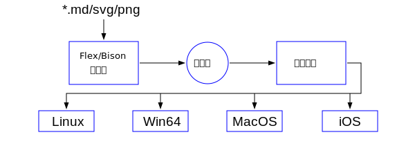

## 什么是MSP?

MSP是一个开源的，百分百原生的，极简约的文档阅读器，支持Markdown, SVG和PNG的显示，故名MSP(Markdown + SVG + PNG)。MSP不依赖除了操作系统以外的任何第三方的软件。为了保持软件的体积最小，MSP不支持除了Markdown/SVG和PNG以外的其它任何格式的内容。MSP阅读器的目标是支持Win64/MacOS/iOS/Linux平台。

MSP的体系架构如下：

MSP也可以显示以base64编码嵌入到svg中的png图片，如下所示：

追求极度简约是MSP的设计哲学。MSP最终的可执行文件在Windows平台上为msp.exe。和该程序同一个目录下只有一个显示配置msp.json和一个运行日志文件msp.log。msp.json是json格式，里面规定的显示的宽度，字体和其它布局信息。如果你设计了比较好的显示主题，可以和其它用户分享，只要把msp.json拷贝给别的用户即可。

#### 遵循的规范
- Markdown采用[Commonmark](https://spec.commonmark.org)
- SVG目前支持[SVG 1.1](https://www.w3.org/TR/2011/REC-SVG11-20110816/)标准
- 考虑支持[Tiny VG](https://tinyvg.tech/)，其规范的pdf文档已经上传(tinyvg-specification.pdf)

## 在Windows下的编译方法
- 安装Visual Studio 2022 社区版，免费的，为微软的良心点赞。
- 安装最新版的[CMake](https://cmake.org)，就是一个.exe文件，鼠标双击即可。
- git clone https://github.com/itgotousa/msp.git 或下载本项目的zip包
- 假设本项目的目录在D:\github\msp目录下，在其中建立一个build目录.
- 打开Visual Studio 2022的X64 Native Tools Command Prompt for VS 2022窗口，切换到D:\github\msp\build目录。
- 执行： cmake -G "NMake Makefiles" ../src
- 执行： nmake 或nmake VERBOSE=1
- 编译好的可执行文件是：D:\github\msp\build\arch\windows\msp-win64.exe

***

如果你在编译过程中出现问题，或者有兴趣一同开发，请联系itgotousa@gmail.com

Enjoy coding, enjoy life!

